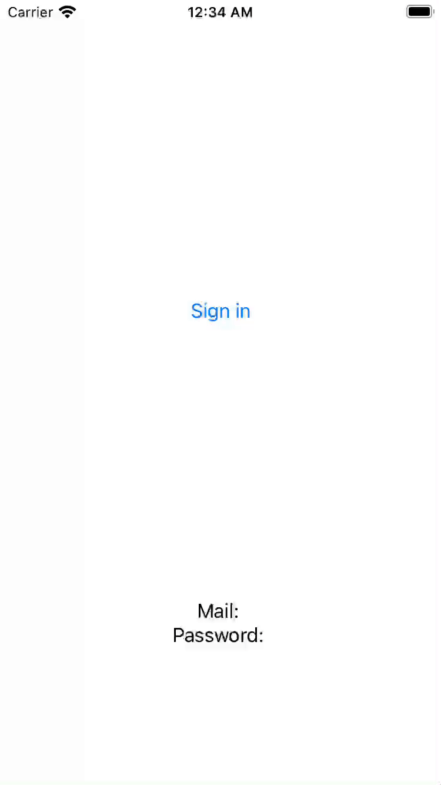

# TextFieldAlert

A SwiftUI alert with text field(s) for iOS 13 and greater.

As Apple is [going to introduce](https://sarunw.com/posts/swiftui-alert-textfield/) text field(s) as an alert actions in iOS 16, this is a good replacement for older versions.

## Requirements
* iOS 13.0+
* Swift 5.1+

## Installation

You can add TextFieldAlert to an Xcode project by adding it as a package dependency.

  1. From the **File** menu, select **Add Packages…**
  2. Enter `https://github.com/sochalewski/TextFieldAlert` into the package repository URL text field.
  3. Add the package to your app target.

## Usage

TextFieldAlert is exposed through `View` extension:

```swift
func textFieldAlert(
    title: String?,
    message: String?,
    textFields: [TextFieldAlert.TextField],
    actions: [TextFieldAlert.Action],
    isPresented: Binding<Bool>
)
```

You can use it in your code as follows:

```swift
struct ExampleView: View {
    
    @State var isPresented = false
    @State var text1 = ""
    @State var text2 = ""
    
    var body: some View {
        VStack {
            Button {
                isPresented = true
            } label: {
                Text("Alert")
            }
            
            Text(text1)
            Text(text2)
        }
        .textFieldAlert(
            title: "Title",
            message: "Message",
            textFields: [
                .init(text: $text1),
                .init(text: $text2)
            ],
            actions: [
                .init(title: "OK")
            ],
            isPresented: $isPresented
        )
    }
}
```

More advanced usage (incl.  moving the responsibility to a view model, some customization and enabling action buttons conditionally) is available in the Example app.



## Author

Piotr Sochalewski, <a href="http://sochalewski.github.io">sochalewski.github.io</a>

TextFieldAlert is heavily inspired by [tanzolone](https://stackoverflow.com/users/3033314/tanzolone)'s [answer](https://stackoverflow.com/a/61902990) on StackOverflow.

## License

TextFieldAlert is available under the MIT license. See the LICENSE file for more info.